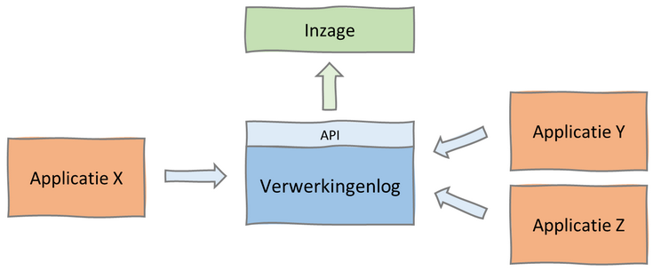
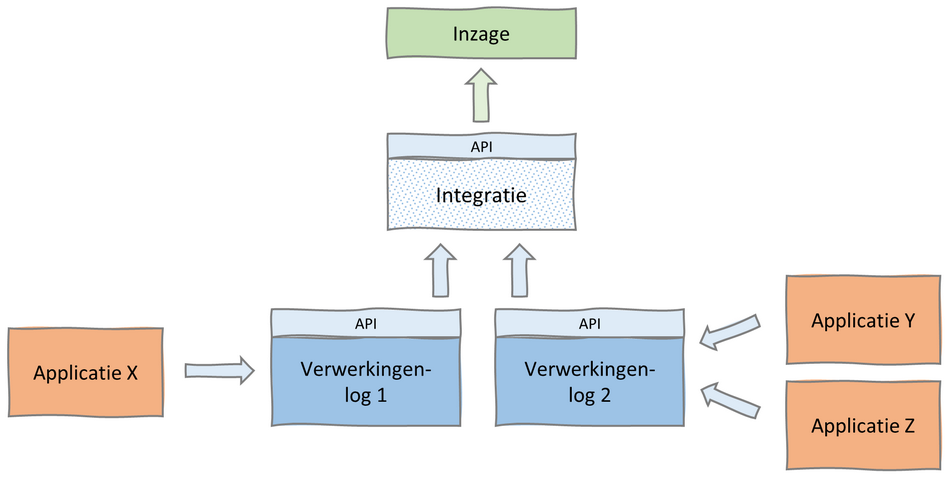
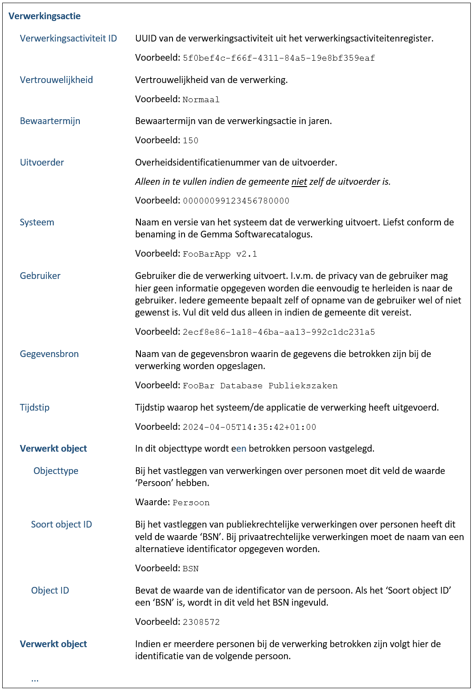
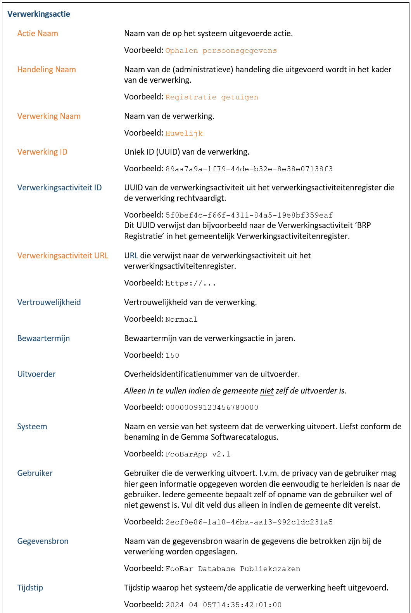
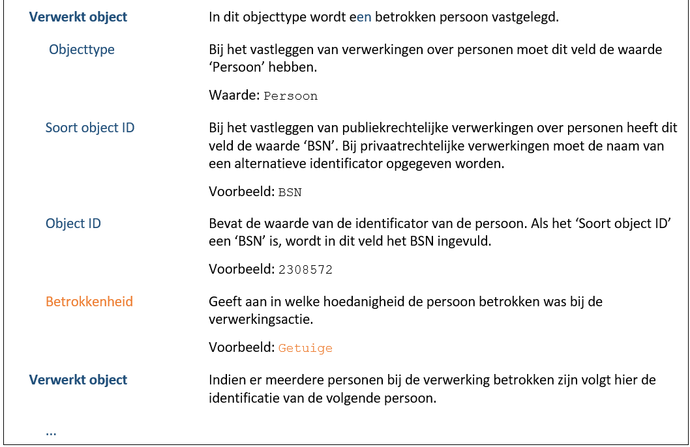

# Readme for Verwerkingenloggingproject

## 1. Huidige situatie
Wat is het probleem?
>Voldoen niet aan AVG-eisen die stelt dat: 'op aanvraag inzage moet worden gegeven in plaatsgevonden verwerkingen van (persoons)gegevens'.
We voldoen niet aan de eis, met als belangrijkste reden dat er geen goede vastlegging plaatsvindt (van wanneer welke gegevensverwerking plaatsvindt).

Wat is het doel?
>Relevante informatie vastleggen (loggen) van verwerkingen van (persoons)gegevens.

Wat is er al aan verwerkingenlogging?
>Nog niets.

## 2. Centraal of Federatief verwerkingenlog
Verwerkingenlog bestaat uit de 'varianten'. Centraal of Federatief.

De kenmerken van de ___centraal verwerkingenlog___ variant zijn: (1) Toegankelijkheid, er is één verwerkingenlog waar logging en inzage geregeld worden. (2) Beschikbaarheid, als het centrale verwerkingenlog uitvalt, moeten alle verwerkingen van de aangesloten system wachten tot de storing is opgelost. (3) Veiligheid, een centraal verwerkingenlog vormt een z.g.n. privacy hotspot.

Hieronder staat een voorbeeld van een potentiële inrichting van het gemeentelijke verwerkingenlog uit de [Quick Start Guide](https://vng-realisatie.github.io/gemma-verwerkingenlogging/quickstart/index) van de VNG. Dit voorbeeld bestaat uit één centraal verwerkingenlog waarin alle informatiesystem hun verwerkingen loggen:



Het alternatief is een ___federatief verwerkingenlog___. Deze variant kenmekrt zich met: (1) Toegangkelijkheid, ieder systeem logt naar het verwerkingenlog dat aan het systeem is toegewezen. Om inzage eenvoudig te houden is het aan te bevelen om een centraal punt te introduceren dat instaat is de gegevens uit de diverse verwerkingenlogs op te halen. (2) Beschikbaarheid, als een verwerkingenlog uitvalt, worden alleen de verwerkingen van de aangesloten system opgeschort. Andere systemen draait gewoon door. (3) Veiligheid, de federatieve verwerkingenlogs bevatten per stuk minder informatie en zijn dus minder snel een privacy hotspot.

Hieronder staat een voorbeeld van de federatieve verwerkingenlog variant:



## 3. Volledige logging van verwerkingen
Aangezien we voor nu uitgaan dat we verwerkingen van persoonsgegevens gaan loggen is een volledige logging van de verwerkingen verplicht. De minimale variant kan wel gebruikt worden als eerste stap.

De volledige logging van verwerkingen richt zich op twee aspecten: Begrijpelijkheid en Aanpasbaarheid.

### 3.1 Begrijpelijkheid
Om te komen tot een begrijpelijk verwerkingenlog werken we met de volgende begrippen: Verwerking, Handeling en Actie. Toelichting op de begrippen:

- __Verwerking__: Een verwerking is een concrete taak die een gemeente uitvoert. De taak vormt vanuit het perspectief van de burger of medewerker een logisch geheel. Vaak correspondeert een verwerking met een verzoek of zaak. Hoort de verwerking bij een globale verwerkingsactiviteit, zoals ‘BRP registratie’, dan geeft de verwerking nadere informatie over het soort verwerking.
- __Handeling__: Een handeling is één stap in de uitvoering van een verwerking. Deze stap kan bij een zogenaamde ‘happy flow’ zonder onderbrekingen uitgevoerd worden. Bestaat een verwerking maar uit één stap dan kan dit niveau weggelaten worden. De informatie is vooral van belang bij processen of zaken die uit meerdere stappen bestaan die verspreid over een bepaalde periode uitgevoerd worden.
- __Actie__: Een actie is een operatie die wordt uitgevoerd door een geautomatiseerd systeem waarbij er (persoons)gegevens verwerkt worden. Een actie wordt uitgevoerd als onderdeel van (een handeling van) een verwerking. In de praktijk zal het uitvoeren van een handeling al snel leiden tot meerdere verwerkingsactiviteiten in het verwerkingenlog die relatief snel achter elkaar uitgevoerd zijn. De actie kan helpen om te begrijpen waarom het log al deze verschillende verwerkingsactiviteiten bevat.

### 3.2 Aanpasbaarheid
Over de inhoud van een verwerkingenlog mag geen twijfel bestaan. We willen daarom dat iets dat in het verwerkingenlog is opgeslagen niet gewijzigd kan worden (het verwerkingenlog is immutable).

Er zijn echter gevallen waarin we het log toch zullen moeten wijzigen:

1. Het wijzigen van de vertrouwelijkheid van een verwerking. Bijvoorbeeld omdat deze wordt opgeheven. Zie hiervoor de [functie F2969: Wijzig vertrouwelijkheid van verwerking](https://github.com/VNG-Realisatie/gemma-verwerkingenlogging/blob/master/docs/_content/achtergronddocumentatie/ontwerp/artefacten/2969.md).
2. Het wijzigen van de bewaartermijn van een verwerking. Bijvoorbeeld omdat deze pas op een later moment bepaald kan worden. Zie hiervoor de [functie F4415: Wijzig bewaartermijn van verwerking](https://github.com/VNG-Realisatie/gemma-verwerkingenlogging/blob/master/docs/_content/achtergronddocumentatie/ontwerp/artefacten/4415.md).

## 4. API standaard

- De API voor bewerking van verwerkingen is [hier](https://petstore.swagger.io/?url=https://raw.githubusercontent.com/VNG-Realisatie/gemma-verwerkingenlogging/develop/docs/_content/api-write/oas-specification/logging-verwerkingen-api/openapi.yaml#/) te vinden.
- De API voor inzage van verwerkingen door betrokkenen en derden is [hier](https://petstore.swagger.io/?url=https://raw.githubusercontent.com/VNG-Realisatie/gemma-verwerkingenlogging/master/docs/_content/api-read/oas-specification/logging-verwerkingen-api/openapi.yaml) te vinden.

## 5. Logging

Systemen of applicaties loggen (mininmaal) de volgende informatie:



Technisch gezien zijn maar weinig velden in het bericht verplicht (zie Logging API). De velden zijn optioneel gemaakt om te voorkomen dat er niet gelogd wordt op het moment dat bepaalde informatie echt niet voorhanden is. Operationeel gezien moet wel geprobeerd worden zoveel mogelijk informatie te verstrekken. De velden zijn namelijk direct afgeleid uit de vereisten die de AVG stelt en zijn daarmee functioneel gezien niet optioneel.

Aan een verwerkingsactie kunnen meerder 'verwerkt objecten' vastzitten. Bijvoorbeeld als er meerdere personen bij een verwerking betrokken zijn.

Een volledige verwerkingsactiviteit komt er zo uit te zien:


.+ nog additionele 'vewerkt objecten' indien van toepassing:


## 6. DB structuur (OUTDATED)
```All items with the same partition key value are stored together, in sorted order by sort key value.```

Dit betekent dat als we objecttype#soortObjectId#objectId als partition key (pk) combinatie gebruiken we alle verwerkingen die gekoppeld zijn aan deze pk kunnen vinden. Dit betekent dat een verwerking (actieId) meerdere keren voor kan komen in de DB onder verschillende pk's.

Als sort key (sk) kunnen we het tijdstip gebruiken. Time range kan dan worden gerealiseerd met behulp van een "BETWEEN" ComparisonOperator op begindatum en eindDatum in de tabel. 

Om een wijziging (PUT) door te voeren op een specifieke verwerking (actieID) dan gebruiken we een Global Secondary Index waarbij de actieID de pk is. (Omdat deze call speciefiek op actieId is [PUT /verwerkingsacties/{actieId}] is een sk niet nodig, ander kun je een mismatch krijgen van verwerkingen die gerelateerd zijn aan verschillende verwerkte-objecten/personen). Met deze GSI kunnen we ook direct een [GET /verwerkingsacties/{actieId}] en [DELETE /verwerkingsacties/{actieId}] doen.

POST:
Verwerkingsactie{} -->
    verwerkteObjecten[]

GET:
results[] -->
    verwerkingsactie{}

PK: UUID(verwerkingId) --> SK: Gebruiker(verwerktObject) --> SSK: Tijdstip(tijdstipRegistratie)

PK: Gebruiker --> SK: verwerking --> SSK: tijdstip

PK: VerwerkingID (UUID) --> SK: GebruikerID (bsn#1209383) 

>- PRIMARY INDEX: PK: GebruikerID (bsn#2344324) --> SK: Tijdstip --> Attr: Verwerkingen
>- SECONDARY INDEX: PK: verwerktObjectId (UUID4) --> SK: verwerktObjectId (UUID4)

### 6.1 GET

Een applicatie moet per verwerkt object (persoon) de gerelateerde verwerkingen op kunnen vragen binnen een bepaald tijdsframe (begin- en einddatum). Verwerkte objecten kunnen opgevraagd worden dmv de juiste parameters mee te geven:
- objecttype (persoon)
- soortObjectId (BSN)
- objectId (479000001)
- beginDatum (2020-10-24)
- eindDatum (2020-11-24)

De response bestaat dan uit 1 of meerdere resultaten. Een resultaat bestaat uit een verwerking gelinkt aan het verwerkte object. Een applicatie ontvangt dus meerdere verwerkingen met dezelfde gelinkte verwerkt object.

Er kan ook een specifiek verwerkt object worden opgevraagd mbv het verwerktObjectId (UUID4)

### 6.2 POST

Een applicatie kan een verwerkingsactie aanmaken. Deze actie moet een eigen actieId (UUID4) krijgen. (Deze wordt gegenereerd vanuit de lambda?). Dit is een post waarin de verwerkingsactie staat met daarin gerelateerde verwerkte objecten (personen). Een verwerkingsactie kan ook worden opgehaald (GET), gewijzigd (PUT) of vervallen (DELETE) mbv het actieId.
